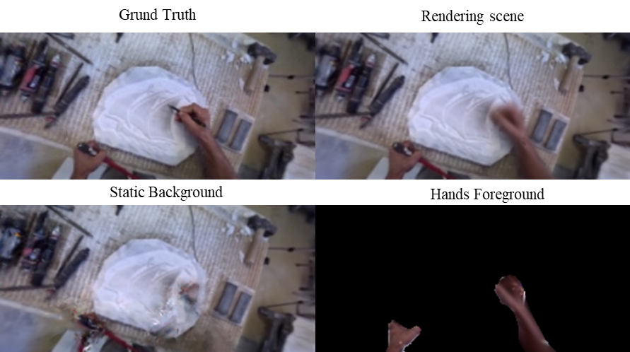

# Egocentric 4D Complex Scene Rendering and Hands Decomposition with Deformable 3D Gaussian Splatting

## [Project page](https://egomask.github.io/)



This repository contains the official implementation associated with the paper "Egocentric 4D Complex Scene Rendering and Hands Decomposition with Deformable 3D Gaussian Splatting".


## Dataset

In our paper, we use:

- Craft Egocentric Dataset [AImove](https://www.kaggle.com/datasets/olivasbre/aimove?select=EgoMask).

We organize the datasets as follows:

```shell
├── data EgoMask
│   | glass 
│     ├── depth_gt
│     ├── images 
│     ├── masks
│     ├── ...
│   | leather
│     ├── depth_gt
│     ├── images 
│     ├── masks
│     ├── ...
│   | marble
│     ├── depth_gt
│     ├── images 
│     ├── masks
│     ├── ...
```

> Each frame is paired with a corresponding depth image and hands mask, generated by prior data-driven models,  [Depth Anything](https://github.com/DepthAnything/Depth-Anything-V2) and [Track Anything](https://github.com/gaomingqi/Track-Anything). Additionally, each frame includes paired camera space position, orientation, and both extrinsic and intrinsic parameters generated by COLMAP.


## Pipeline


## Run

### Environment

```shell
git clone https://github.com/egomask/EgoMask-3DGS.git --recursive
cd EgoMask-3DGS

conda create -n EgoMask_env python=3.7
conda activate EgoMask_env_env

# install pytorch
pip install torch==1.13.1+cu116 torchvision==0.14.1+cu116 --extra-index-url https://download.pytorch.org/whl/cu116

# install dependencies
pip install -r requirements.txt
```


### Train

**EgoMask Dataset:**

```shell
python train.py -s path/to/Egomask/dataset -m output/exp-name --eval --is_blender
```

### Render & Evaluation

```shell
python render.py -m output/exp-name --mode render
python metrics.py -m output/exp-name
```

We provide several modes for rendering:

- `render`: render all the test images
- `time`: time interpolation tasks for D-NeRF dataset
- `all`: time and view synthesis tasks for D-NeRF dataset
- `view`: view synthesis tasks for D-NeRF dataset
- `original`: time and view synthesis tasks for real-world dataset


## Acknowledgments

Our code is developed based on [3D Gaussian Splatting](https://repo-sam.inria.fr/fungraph/3d-gaussian-splatting/), and [Deformable 3D Gaussians](https://ingra14m.github.io/Deformable-Gaussians/). Many thanks to the authors for opensoucing the codebase.
